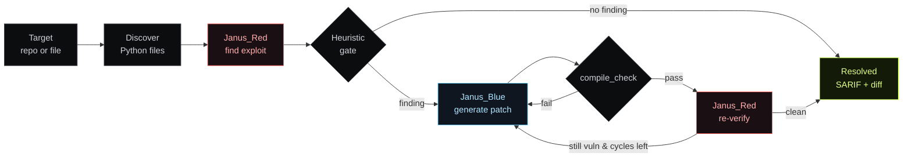

<div align="center">


<br />

<a href="#quickstart">
  
</a>

<br /><br />

<p>
  
  
  
  
  
</p>

<p>
  
  
  
  
  
</p>

<p>
  <a href="#quickstart"><strong>Quickstart</strong></a>
  &nbsp;·&nbsp;
  <a href="#the-loop"><strong>How it works</strong></a>
  &nbsp;·&nbsp;
  <a href="#dashboard"><strong>Dashboard</strong></a>
  &nbsp;·&nbsp;
  <a href="#cli">CLI</a>
  &nbsp;·&nbsp;
  <a href="#api">API</a>
  &nbsp;·&nbsp;
  <a href="#stack">Stack</a>
</p>

</div>

---

## What it is

Most security scanners tell you *that* a vulnerability exists. They do not fix it.

**Openwing Janus** runs two LLM agents against your Python codebase in an adversarial loop:

- **Janus_Red** is the attacker. It walks every request handler, traces untrusted input to dangerous sinks, and emits concrete exploit payloads — not hints.
- **Janus_Blue** is the patcher. It reads Red's findings, generates a fix, runs Python's compile gate, and writes the patch to disk.
- **LangGraph** ties them together: Red attacks → Blue patches → Red re-verifies → loop until the code holds, or the cycle budget is exhausted.

Sub-second per file on a single AMD MI300X with vLLM. SARIF 2.1 export plugs straight into GitHub code-scanning.

<br />

<div align="center">
  
</div>

---

## The loop



The graph is implemented as a `langgraph.StateGraph`. Each transition emits a structured trace event consumed by the CLI's Rich output, the FastAPI server's SSE stream, and the dashboard.

<br />

---

## Quickstart

Pick one path. The full experience runs both backend and frontend together; the dashboard alone runs without any Python.

<br />

<table>
<tr>
<td width="50%" valign="top">

### Backend &middot; CLI &amp; API

```bash
git clone https://github.com/your-org/openwing-janus
cd openwing-janus
pip install -e ".[dev]"

# Point at any OpenAI-compatible endpoint
export OPENAI_BASE_URL=http://localhost:8000/v1
export LLM_MODEL=Qwen/Qwen2.5-72B-Instruct

# CLI scan
janus run --path ./examples/vulnerable_app/app.py --backup

# Or boot the API + dashboard
uvicorn janus.server:app --host 0.0.0.0 --port 5000
```

Open `http://localhost:5000` &mdash; FastAPI serves the built dashboard.

</td>
<td width="50%" valign="top">

### Frontend &middot; dashboard only

```bash
cd frontend
npm install
npm run dev
```

Open `http://localhost:5173` &mdash; Vite proxies `/api/*` to the backend on port 5000 if it is running, otherwise the dashboard falls back to a paced replay flow so judges and reviewers always see a complete walkthrough.

```bash
# Build for production
npm run build
npm run preview
```

</td>
</tr>
</table>

<br />

---

## Dashboard

The web UI is a single-page React app served by FastAPI in production, or by Vite in dev. Eight screens, all driven by the same SSE stream and store.

<div align="center">

| Screen        | Purpose                                                                                  |
| ------------- | ---------------------------------------------------------------------------------------- |
| **Scan**      | Set the target. GitHub URL, local directory, or single file. Picks model, scope, cycles. |
| **Sweep**     | Per-file lanes: discovery, scan time, state (critical / clean), finding count.           |
| **Duel**      | Live trace. Red events on the left, Blue on the right, streaming as the loop runs.       |
| **Patch**     | Side-by-side diff of every fix Blue wrote, with the trigger snippet annotated.           |
| **Verify**    | Post-patch re-scan. Confirms exploits are gone; flags anything that survived.            |
| **Report**    | Findings list with CWE, CVSS, severity, payload. One-click SARIF 2.1 export.             |
| **History**   | Previous runs with duration, finding count, fix rate, status.                            |
| **Settings**  | Provider chain, GPU info, budget, theme tweaks.                                          |

</div>

Keyboard shortcuts: `1`–`8` jump screens · `←` `→` step through · `⌘K` command palette · `E` export SARIF.

<br />

---

## CLI

Typer + Rich. `janus --help` for the full reference.

```bash
janus run --path ./src/myapp                # sweep a directory
janus run --path app.py --dry-run --json    # CI-friendly, no writes
janus run --path . --max-files 250 --backup # crawl with safety rails
janus run --github github.com/owner/repo    # clone + scan
```

| Flag             | Effect                                                              |
| ---------------- | ------------------------------------------------------------------- |
| `--path`         | File or directory. Directories sweep tracked Python modules.        |
| `--github`       | Clone a GitHub URL into a temp dir before scanning.                 |
| `--dry-run`      | Run Red and Blue without rewriting any source files.                |
| `--backup`       | Copy `<file>.<utc>.janus.bak` before each in-place write.           |
| `--max-cycles`   | Patch budget per file. Default `3`.                                 |
| `--syntax-tries` | Adaptive retries when Blue's patch fails `compile_check`. Default `4`. |
| `--max-files`    | Hard cap when crawling large trees.                                 |
| `--json`         | Machine-readable output (single record or array).                   |

In-place patches are destructive without `--dry-run`. Pair with `--backup` or rely on Git.

<br />

---

## API

FastAPI server at `src/janus/server.py`. All endpoints are documented at `/docs` (Swagger) and `/redoc`.

| Method   | Path                          | Purpose                                  |
| -------- | ----------------------------- | ---------------------------------------- |
| `POST`   | `/api/runs`                   | Create and start a scan.                 |
| `GET`    | `/api/runs`                   | List recent runs.                        |
| `GET`    | `/api/runs/{id}`              | Single run status &amp; result.          |
| `GET`    | `/api/runs/{id}/events`       | SSE live trace stream.                   |
| `GET`    | `/api/runs/{id}/findings`     | Structured findings for a completed run. |
| `DELETE` | `/api/runs/{id}`              | Cancel or discard a run.                 |
| `GET`    | `/api/health`                 | Provider health probe.                   |
| `GET`    | `/api/system`                 | GPU / endpoint / budget snapshot.        |

The SSE channel emits structured trace events: `system`, `red.thought`, `red.code`, `red.finding`, `blue.thought`, `blue.patch`, `red.verify`, `system.ok` (with summary), `eof`.

<br />

---

## Configuration

| Variable          | Purpose                                                | Default                       |
| ----------------- | ------------------------------------------------------ | ----------------------------- |
| `OPENAI_API_KEY`  | Bearer token if your endpoint requires it              | `EMPTY`                       |
| `OPENAI_BASE_URL` | OpenAI-compatible API root (must include `/v1`)        | `http://localhost:8000/v1`    |
| `LLM_MODEL`       | Model id (alias: `OPENAI_MODEL`, `JANUS_MODEL`)        | `Qwen/Qwen2.5-72B-Instruct`   |
| `OPENAI_TIMEOUT`  | HTTP timeout in seconds                                | `120`                         |
| `JANUS_PROVIDER`  | `amd`, `groq`, `openai`, or `auto` (fallback chain)    | `auto`                        |
| `JANUS_RATE_LIMIT`| Requests per minute per IP (server)                    | `20`                          |

Bare URLs without `/v1` are auto-suffixed by `janus.llm.load_llm_config`.

<br />

---

## Stack

<div align="center">

<table>
<tr>
<td align="center" width="20%">
<br />
<sub><b>Python 3.10+</b></sub>
</td>
<td align="center" width="20%">
<br />
<sub><b>FastAPI</b></sub>
</td>
<td align="center" width="20%">
<br />
<sub><b>React 18</b></sub>
</td>
<td align="center" width="20%">
<br />
<sub><b>TypeScript</b></sub>
</td>
<td align="center" width="20%">
<br />
<sub><b>Vite 5</b></sub>
</td>
</tr>
<tr>
<td align="center">
<br />
<sub><b>Docker</b></sub>
</td>
<td align="center">
<br />
<sub><b>GitHub Actions</b></sub>
</td>
<td align="center">
<br />
<sub><b>Vercel</b></sub>
</td>
<td align="center">
<br />
<sub><b>ROCm 6.2</b></sub>
</td>
<td align="center">
<br />
<sub><b>Node 20+</b></sub>
</td>
</tr>
</table>

<br />

<sub>Inference: <b>Qwen/Qwen2.5-72B-Instruct</b> on <b>vLLM 0.6</b> · <b>AMD Instinct MI300X</b> (192 GB HBM3) · provider chain falls back to Groq and OpenAI.</sub>

</div>

<br />

---

## Acceptance criteria

| Criterion                          | How Janus addresses it                                                                |
| ---------------------------------- | ------------------------------------------------------------------------------------- |
| vLLM on localhost                  | `OPENAI_BASE_URL` + `httpx` client to `/chat/completions`                             |
| Red finds Flask SQLi (scoped)      | Red prompt + strict JSON schema (`RedTeamReport`)                                     |
| Blue emits safe remediations       | Blue prompt covers SQLi parameterization plus SSRF / subprocess / deserialization     |
| Cyclic verify (max 3)              | LangGraph `StateGraph`: scan &rarr; gate &rarr; verify / Blue + compile &rarr; write   |
| No exploit execution               | Payloads are informational strings; no subprocess / interpreter eval                  |
| Readable CLI                       | Typer + Rich with run-table summaries                                                 |
| CI without live LLM                | `pytest` mocks `janus.llm.sync_chat`                                                  |
| Live observability                 | FastAPI SSE + dashboard with eight role-specific screens                              |

<br />

---

## Limitations

- **Directory sweeps** are sequential, not parallel clusters; respect `--max-files` rails.
- **Hybrid gate**: regex heuristics override hallucinated clean scans &mdash; escalate manual review whenever notes print.
- **Model quality dominates**: compile checks catch syntax breakage, not semantic parity vs. production traffic.
- **JSON repair**: malformed Red output triggers one automatic repair ping (`agents.red_team_scan`).

<br />

---

## Tests

```bash
pytest                 # full suite, mocks LLM
pytest -k "graph"      # focused
pytest --cov=janus     # with coverage
```

<br />

---

## Roadmap

- [ ] Parallel cluster sweeps with worker pool
- [ ] Auto PR opener for Blue's patches
- [ ] Multi-language support (TypeScript / Go / Rust)
- [ ] Custom CWE knowledge base loader
- [ ] Persistent run store (SQLite)
- [ ] Webhook + Slack / Discord notifications
- [ ] Prompt-injection benchmark on Red's verdict gate

<br />

---

## License

MIT &mdash; see [LICENSE](./LICENSE).

<br />

<div align="center">

<sub>Built for the AMD Developer Cloud hackathon.</sub>

<br />


</div>
